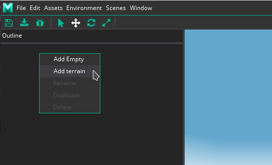
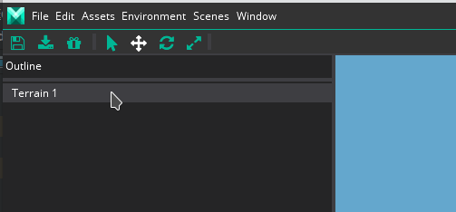
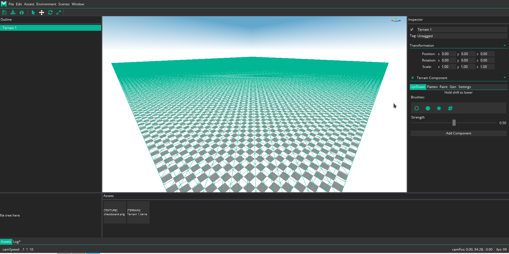
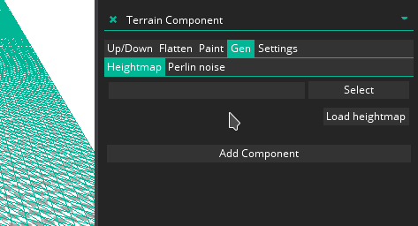
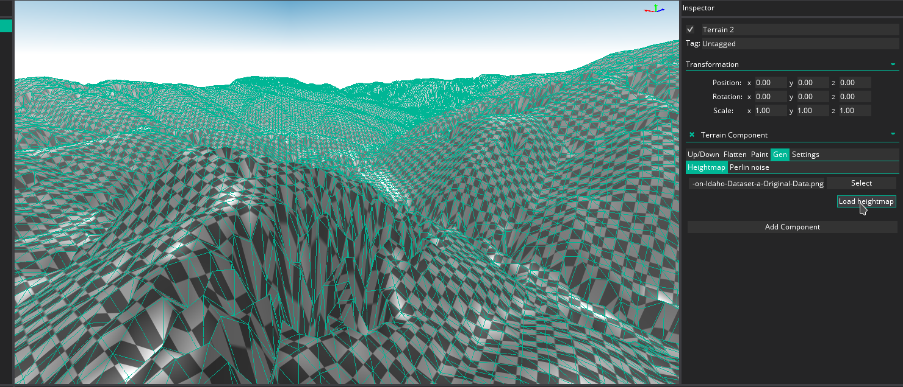
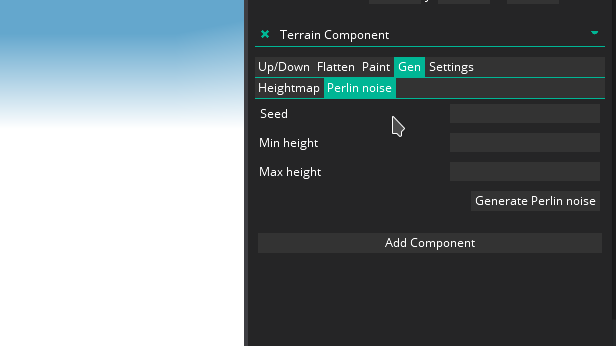
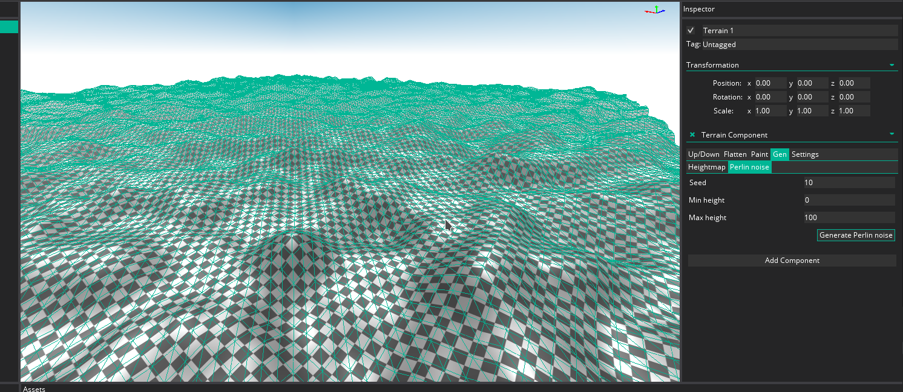

# Terrain

## Create terrain

Right click to the ``Outline`` section and click to the ``Add terrain`` button.

The terrain created with ``Terrain`` name.

If you select it with left click then you can see the terrain in the on the editor.

## Load heightmap

You can generate heightmap after selected the terrain.
You see the settings on the ``Height map`` tab on ``Gen`` tab.
Here you can select the height map image.

If you select a heightmap and click to the ``Load heightmap`` button than it will modify the selected terrain.

## Generate Perlin noise

You can generate Perlin noise after selected the terrain.
You see the settings on the ``Perlin noise`` tab on ``Gen`` tab.
Here you can set the ``Seed``, ``Min height`` and ``Max height``.

If you set these values and click to the ``Generate Perlin noise`` button than it will modify the selected terrain.

